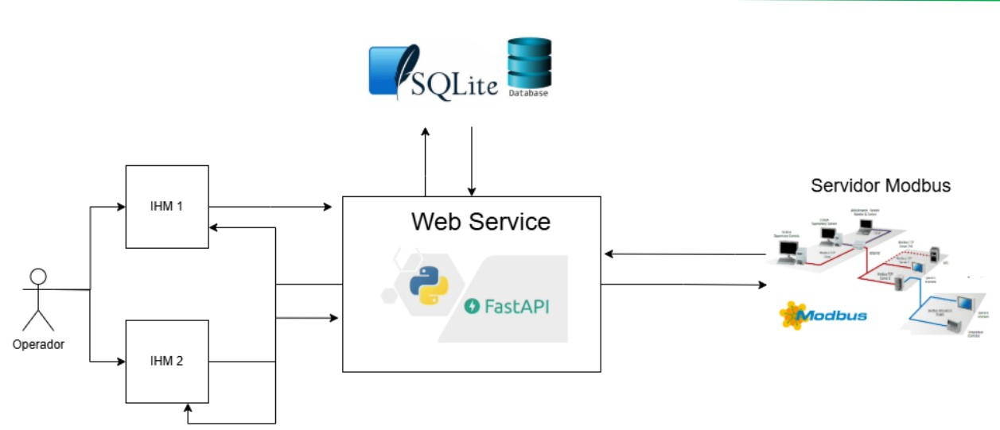

# Projeto: Protótipos de IHMs para Monitoramento e Controle de uma Planta de Cafeicultura

Este projeto foi desenvolvido como parte da disciplina de **Integração de Sistemas de Automação** do Instituto Federal do Espírito Santo (IFES). O objetivo é criar dois protótipos de Interfaces Homem-Máquina (IHMs) para o monitoramento e controle de uma planta de produção, seguindo os princípios da norma **ISA 101**.

## Contexto

O contexto escolhido foi o setor **agrícola**, com foco em uma **plantação de café**. Este segmento é relevante devido à sua importância econômica e aos diversos fatores ambientais e operacionais que influenciam a qualidade e produtividade dos grãos de café. As IHMs serão projetadas para facilitar o acompanhamento e o controle de variáveis críticas da plantação.

## Variáveis Monitoradas/Controladas

As IHMs serão desenvolvidas para monitorar e controlar entre 5 e 10 variáveis relevantes para a plantação de café. As variáveis escolhidas foram:

1. **Temperatura Ambiente** (°C).
2. **Nível de Irrigação** (Litros/hora).
3. **Índice de Luz Solar** (W/m²).
4. **Velocidade do Vento** (m/s).
5. **Umidade do Solo** (%).
6. **pH do Solo**.
7. **Temperatura do Solo** (°C).
8. **Concentração de Nitrogênio no Solo** (ppm de Nitrogênio).
9. **Presença de Pragas** (detecção binária: Sim/Não).

## Regras de Automação

Com base nas variáveis acima, foram definidas as seguintes regras de automação:

1. **Controle de Irrigação**:

   - Se a umidade do solo for menor que 30%, ativar o sistema de irrigação.
   - Se a umidade do solo ultrapassar 80%, desativar o sistema de irrigação.

2. **Controle de Temperatura Ambiente**:

   - Se a temperatura ambiente for maior que 35°C, acionar o sistema de nebulização para resfriamento.

3. **Correção de pH do Solo**:

   - Se o pH do solo for menor que 5,5, ativar a aplicação de calcário para correção.

4. **Gestão de Luz Solar**:

   - Se o índice de luz solar for menor que 400 W/m² por mais de 4 horas, alertar para a necessidade de iluminação artificial em estufas.

5. **Detecção de Pragas**:

   - Se for detectada a presença de pragas, emitir um alarme para o operador e sugerir aplicação de pesticida.

6. **Controle Preventivo de Ventos**:
   - Se a velocidade do vento for maior que 30 m/s, alertar sobre riscos de danos às plantas e sugerir medidas de proteção.

7. **Nutrição Automática do Solo**:
   - Se a concentração de nutrientes for menor que os níveis ideais (ex.: Nitrogênio < 20 ppm), ativar a aplicação de fertilizante automaticamente.

## Arquitetura do Sistema

A arquitetura do sistema é apresentada abaixo:

